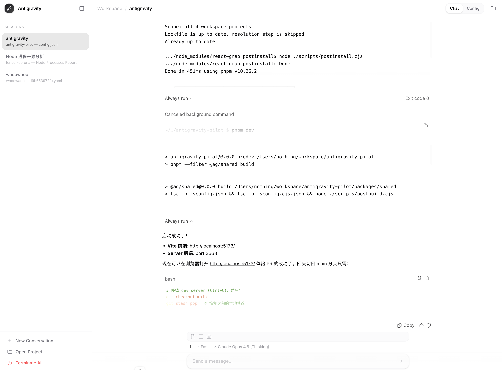

<p align="center">
  <br />
  <strong>🚀 Antigravity Pilot</strong>
  <br />
  <em>远程监控和操控 Antigravity IDE 的 Web UI</em>
  <br /><br />
  <a href="#快速开始">快速开始</a> · <a href="#架构">架构</a> · <a href="#配置">配置</a> · <a href="#工作原理">工作原理</a>
  <br />
  <a href="README.md">English</a> · 简体中文 · <a href="README.zh-TW.md">繁體中文</a>
</p>

---

**Antigravity Pilot** 是一个轻量级 Web UI，通过 Chrome DevTools Protocol (CDP) 连接到 [Antigravity IDE](https://antigravity.google)。它实时镜像 IDE 的聊天界面，让你可以在任意浏览器、任意设备上发送消息、点击按钮、管理会话。

<p align="center">
  
</p>

<br />

## 快速开始

```bash
# 克隆
git clone https://github.com/Nothing1024/antigravity-pilot.git
cd antigravity-pilot

# 安装依赖
pnpm install

# 配置
cp config.example.json config.json
# 编辑 config.json — 至少设置密码

# 启动
pnpm dev
```

在浏览器中打开 `http://<你的IP>:5173`（开发模式）。

生产环境：`pnpm build && pnpm start`，然后访问 `http://<你的IP>:3563`。

### 启动 Antigravity IDE (macOS)

```bash
# 基础 — 开启 CDP 调试端口
open -a "Antigravity" --args --remote-debugging-port=9000

# GPU 优化版（提升 Antigravity 渲染性能）
open -a "Antigravity" --args --disable-gpu-driver-bug-workarounds --ignore-gpu-blacklist --enable-gpu-rasterization --remote-debugging-port=9000
```

> **注意** (ಥ_ಥ)  如果聊天视图偶尔卡住或停止更新，这通常是 Antigravity IDE 自身的问题，不是本项目的 bug。刷新页面或重启 IDE 即可恢复。

## 架构

```
┌─────────────────┐      CDP / WebSocket       ┌────────────────┐      HTTP / WS      ┌───────────┐
│   Antigravity    │◄──────────────────────────►│   @ag/server   │◄────────────────────►│   浏览器   │
│      IDE         │   端口 9000–9003           │   端口 3563     │                      │   (PWA)   │
│   (Electron)     │                            │  (Express+WS)  │                      │           │
└─────────────────┘                             └────────────────┘                      └───────────┘
```

**Monorepo 结构（pnpm workspaces）：**

| 包 | 职责 |
|---|------|
| `@ag/shared` | TypeScript 类型定义和 WebSocket 消息协议 |
| `@ag/server` | Express 后端 — CDP 连接管理、快照循环、自动操作、推送通知 |
| `@ag/web` | React 19 + Vite 前端 — Shadow DOM 渲染器、Zustand 状态管理、i18n |

<br />

## 配置

编辑项目根目录下的 `config.json`：

```jsonc
{
  "password": "your-password",        // 登录密码
  "port": 3563,                       // Web 服务端口
  "antigravityPath": "",              // Antigravity 可执行文件路径（空 = 自动检测）
  "cdpPorts": [9000, 9001, 9002, 9003],  // CDP 扫描端口
  "managerUrl": "http://127.0.0.1:8045", // 可选：Antigravity-Manager 地址
  "managerPassword": "",              // 可选：Manager API 密钥
  "vapidKeys": null                   // 首次运行时自动生成
}
```

### 客户端设置（保存在 localStorage）

这些设置通过 Web UI 的**设置**页面配置：

| 设置 | 说明 |
|------|------|
| **主题** | 浅色 / 深色 / 跟随系统 |
| **语言** | English / 简体中文（首次访问自动检测浏览器语言） |
| **发送方式** | Enter 发送 / Ctrl+Enter 发送 |
| **自动全部接受** | 出现"Accept all"时自动点击 |
| **自动重试** | Agent 报错时自动点击"Retry" |
| **指数退避** | 重试间隔递增：10秒 → 30秒 → 60秒 → 120秒 |

> 客户端设置存储在 `localStorage` 中，页面加载时同步到服务端。服务端重启后设置不会丢失。

<br />

## 工作原理

1. **发现** — 服务端每 10 秒轮询 CDP 调试端口，寻找 Antigravity 工作台窗口
2. **快照循环** — 每 1 秒通过 `Runtime.evaluate` 捕获聊天 DOM，按哈希对比差异，通过 WebSocket 推送更新
3. **渲染** — 前端接收 HTML 快照，在 Shadow DOM 中通过 [morphdom](https://github.com/patrick-steele-idem/morphdom) 进行差异更新
4. **点击透传** — 可点击元素映射到 CSS 选择器，通过 CDP `Input.dispatchMouseEvent` 派发点击事件，确保 Electron 兼容性
5. **自动操作** — 每次快照后检查目标按钮，自动点击并支持可配置的冷却时间

<br />

## 技术栈

| 层级 | 技术 |
|------|------|
| Monorepo | pnpm workspaces |
| 语言 | TypeScript（严格模式） |
| 后端 | Express 4 · ws 8 · web-push |
| 前端 | React 19 · Vite 6 · Zustand 5 |
| 国际化 | 轻量自研方案（零外部依赖） |
| DOM 差异对比 | morphdom |
| 协议 | Chrome DevTools Protocol (CDP) |
| PWA | Service Worker · Web Push (VAPID) |

<br />

## 许可证

MIT
